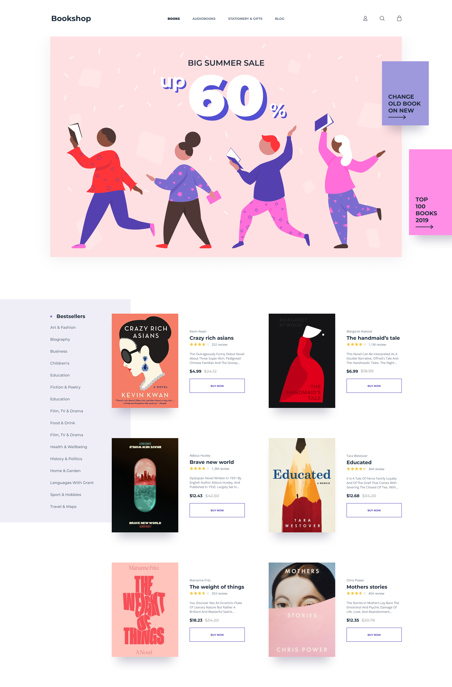

# BookShop

Esta é a implemetação do Design Criado pela Olha Soroka, [Design Free do Uplabs](https://www.uplabs.com/posts/bookshop-website-70dcb988-5591-400c-a294-21f915be4db6).

## Índice

- [Visão Geral](#overview)
  - [O Design](#the-challenge)
  - [Links](#links)
- [Etapas](#my-process)
  - [Construído com](#built-with)
  - [Desenvolvimento contínuo](#continued-development)
- [Autor](#author)
- [Agradecimentos](#acknowledgments)

## Visão Geral

### O Design

### Links

- Design URL: [https://www.uplabs.com/](https://www.uplabs.com/posts/bookshop-website-70dcb988-5591-400c-a294-21f915be4db6)
- Live Site URL: [https://bookshop-micaelsgarcez.vercel.app/](https://bookshop-micaelsgarcez.vercel.app/)

## Etapas

### Construído com

- HTML5
- CSS
- Flexbox
- CSS Grid
- Mobile-first
- [React](https://reactjs.org/) - JS library
- [Next.js](https://nextjs.org/) - React framework
- [TailwindCSS](https://tailwindcss.com/) - CSS framework
- [Framer Motion](https://www.framer.com/motion/) - Para as animações

### Desenvolvimento contínuo

Usei este projeto para continuar focando na área de Frontend, para melhorar o meu desenvolvimento e ficar mais confortável ao dia a dia aprendendo ténicas úteis, refinar e aperfeiçoar mais habilidades.

## Autor

- Website - [Micael Garcez](https://www.micaelweb.com.br)
- Linkedin - [micael-garcez-dev](https://www.linkedin.com/in/micael-garcez-dev/)
- Instagram - [@micaelgarcez.dev](https://www.instagram.com/micaelgarcez.dev/)

## Agradecimentos

Obrigado, pai e mãe por estarem sempre ao meu lado e por me ensinarem tanto!
